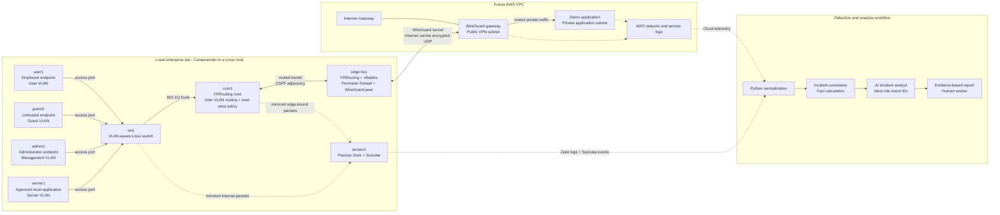

# AI-Assisted Hybrid Network SOC Lab Architecture

## Document purpose

This document defines the target architecture for a reproducible hybrid-network security lab. The lab combines a simulated local enterprise network, an encrypted connection to an AWS VPC, passive network monitoring, and an evidence-grounded AI incident-analysis workflow.

The architecture is intentionally built in stages:

1. Build and validate the local network, routing, segmentation, and monitoring.
2. Add the AWS VPC and WireGuard connection only after the local lab works reliably.
3. Add normalization, correlation, and AI-assisted analysis after trustworthy telemetry exists.

The diagram shows the intended end state. Components labeled as future AWS or analysis components are design targets, not claims that they are already deployed.

## Design goals

- Model recognizable enterprise roles: employees, guests, administrators, servers, network infrastructure, cloud workloads, and SOC sensors.
- Make every routed path and security decision explainable and testable.
- Apply default-deny segmentation and least-privilege access.
- Observe traffic without making the sensor part of the forwarding path.
- Preserve the original local source IP across the VPN so investigations can identify the initiating endpoint. 
- Clearly document what monitoring can and cannot see at each side of the encryption boundary.
- Require the future AI analyst to cite normalized event IDs rather than invent unsupported facts.
- Keep the first deployment small enough for a resource-constrained lab host.

## Network diagram



The dotted lines carry copied packets or logs. They do not carry production traffic. A sensor or analysis failure therefore must not interrupt network forwarding.

## Component responsibilities

### Local enterprise components

| Component | Type | Responsibility | Does not do |
|---|---|---|---|
| `user1` | Endpoint | Represents an employee workstation and generates approved application traffic. | Manage infrastructure or bypass segmentation. |
| `guest1` | Endpoint | Represents an untrusted device and generates controlled negative tests such as internal connection attempts. | Receive trusted internal access. |
| `admin1` | Endpoint | Represents an authorized administrator and originates approved management traffic. | Serve ordinary user or guest workloads. |
| `server1` | Endpoint/server | Hosts a small approved local application so routing, firewall, and monitoring tests work before AWS exists. | Route between networks. |
| `sw1` | Layer-2 switch | Places access ports into their VLANs and carries tagged VLAN traffic to `core1` over an 802.1Q trunk. | Route between VLANs or make Layer-3 security decisions. |
| `core1` | Router and internal firewall | Owns VLAN gateway interfaces, performs inter-VLAN routing, runs FRRouting/OSPF, and enforces east-west segmentation. | Terminate the Internet-facing VPN. |
| `edge-fw1` | Perimeter router, firewall, and VPN endpoint | Exchanges local routes with `core1`, enforces north-south/hybrid policy, and later terminates local WireGuard encryption. | Route ordinary inter-VLAN traffic that never leaves the local campus. |
| `sensor1` | Passive SOC sensor | Receives mirrored packets and runs Zeek and Suricata to produce network evidence. | Forward, block, decrypt, or modify traffic. |

`sensor1` initially combines Zeek and Suricata to reduce memory use. These tools can be separated later without changing the traffic path.

### Future AWS components

| Component | Placement | Responsibility |
|---|---|---|
| Internet Gateway | Attached to the VPC | Gives the public VPN subnet a path to and from the Internet. It does not make the private application public. |
| WireGuard gateway | Public VPN subnet | Terminates the AWS side of the tunnel and routes authorized local networks toward the private application subnet. |
| Demo application | Private application subnet | Provides the approved cloud service used for hybrid connectivity and security tests. It has no direct public application path. |
| VPC route tables | VPC subnets | Direct local-enterprise CIDRs to the WireGuard gateway and return traffic to the correct subnet. |
| Security groups | AWS network interfaces | Apply workload-level allow rules, such as accepting the application port only from approved local source networks. |
| AWS telemetry | VPC and relevant services | Supplies cloud-side evidence, such as accepted/rejected flow metadata and host/application logs, to the SOC workflow. |

### Detection and analysis components

| Component | Responsibility |
|---|---|
| Zeek | Produces high-context network activity records, including connections, DNS, and supported application metadata. |
| Suricata | Applies network detection rules and emits alerts plus transaction metadata. |
| Python normalization | Converts source-specific records into a consistent event schema with stable event IDs. |
| Correlation layer | Groups related events and calculates facts such as counts, time windows, and participating addresses before AI analysis. |
| AI incident analyst | Explains an incident using only supplied evidence and cites the supporting event IDs. |
| Human reviewer | Confirms the conclusion, corrects unsupported interpretations, and owns the final response decision. |

## Forwarding and control planes

The **forwarding plane** is the path taken by actual packets:

```text
Endpoint -> sw1 -> core1 -> edge-fw1 -> WireGuard tunnel -> AWS VPN gateway -> private app
```

The **control plane** tells routers which destinations are reachable:

- `core1` and `edge-fw1` form an OSPF neighbor relationship across a routed transit link.
- `core1` advertises the local VLAN networks to `edge-fw1`.
- The first implementation does not run OSPF through WireGuard.
- `edge-fw1` uses an explicit route for the AWS VPC through the tunnel and advertises that reachability locally.
- AWS route tables send the local VLAN networks back through the WireGuard gateway.

This split keeps dynamic routing useful inside the learning lab while keeping the first cloud VPN design understandable and predictable.

## Where routing happens

1. `sw1` switches frames only within the correct VLAN.
2. `core1` is the default gateway for each local VLAN and routes between local VLANs.
3. `core1` sends cloud-bound traffic to `edge-fw1` over the routed transit network.
4. `edge-fw1` routes approved AWS destinations into WireGuard.
5. The AWS WireGuard gateway decrypts the packet and routes it into the VPC.
6. VPC route tables deliver it to the private application subnet and provide the reverse path.

The design is routed end to end. It should avoid source NAT across the hybrid path so cloud logs retain the employee workstation's original private source address.

## Where security decisions happen

Security is layered so that no single device is the only control:

| Decision point | Scope | Example decision |
|---|---|---|
| `core1` nftables | East-west traffic between local VLANs | Allow employee access to approved application ports; deny employee access to management; deny guest access to internal networks. |
| `edge-fw1` nftables | North-south and hybrid traffic | Permit approved local networks to the AWS application; deny guest-to-AWS traffic; deny unsolicited inbound flows. |
| WireGuard peer configuration | Tunnel membership and routed prefixes | Authenticate the two VPN peers and restrict which private prefixes a peer may carry. |
| AWS VPC routes | Cloud path selection | Send return traffic for local VLANs to the VPN gateway rather than the Internet Gateway. |
| AWS security groups | Workload-level access | Accept the application port only from approved local source networks and required administrative sources. |
| Application/host controls | Process and identity access | Authenticate users, validate requests, and restrict host services even when a network path exists. |

Detailed subnets belong in `docs/addressing.md` during step 3. Exact firewall rules and their reasons belong in the step 4 security-policy document. The architecture requires those controls but does not replace those later deliverables.

## Encryption boundary

WireGuard encryption begins on `edge-fw1` after local routing and firewall checks. The encrypted UDP packet crosses the normal Internet connection and reaches the public interface of the AWS WireGuard gateway. Decryption ends on that gateway before the original packet is routed to the private application.

```text
Local packet in clear text                 Encrypted on the Internet               Clear text inside VPC

user1 -> core1 -> edge-fw1  |  edge-fw1 ===== WireGuard UDP ===== AWS VPN  |  AWS VPN -> private app
                             ^ encryption                              decryption ^
```

“Clear text” here means the network sensor can inspect the original IP flow. The application may independently use HTTPS, in which case application content remains encrypted even on the private networks unless it is logged at an authorized endpoint.

WireGuard protects data in transit across the untrusted Internet. It does not replace VLAN segmentation, firewalls, AWS security groups, application authentication, or host security.

## SOC visibility and intentional blind spots

| Observation point or source | What the SOC can observe | What is hidden or unavailable |
|---|---|---|
| Internal mirror near `sw1`/`core1` | Original local source/destination IPs, ports, timing, DNS, supported clear-text metadata, scans, and denied inter-VLAN attempts visible on the mirrored path. | Payload protected by application-layer encryption such as HTTPS; traffic not included in the mirror. |
| Pre-encryption path near `edge-fw1` | Original employee-to-AWS flow before WireGuard encapsulation, including original IPs and transport metadata. | HTTPS content remains encrypted at the application layer. |
| Internet-facing side of WireGuard | Public VPN peer IPs, UDP port, packet sizes, timing, and tunnel availability. | Original inner addresses, ports, protocols, and payload because WireGuard encrypts them. |
| AWS side after decryption | Inner source/destination addresses and cloud-side transport metadata; application and host logs at their source. | HTTPS payload unless observed at an authorized application endpoint; data the enabled AWS log sources do not record. |
| Zeek logs | Connection and supported protocol metadata derived from mirrored traffic. | Packets outside the mirror and encrypted contents Zeek cannot decrypt. |
| Suricata events | Rule matches and protocol/flow metadata visible at its capture point. | Activity for which no rule or visible indicator exists; encrypted inner traffic seen only from outside the tunnel. |
| AWS flow telemetry | Flow metadata such as interfaces, addresses, ports, protocol, and accept/reject disposition when configured. | Full packet payload and application meaning. |
| Application logs | Authorized request outcomes, application events, and correlation/request IDs. | Network activity that never reaches the application and secrets that must not be logged. |

An absence of an alert is not proof that no activity occurred. Investigation must consider capture placement, enabled log sources, encryption, retention, clock accuracy, and sensor health.

## Employee workstation to AWS application: packet walkthrough

Assume `user1` requests an approved service on the future private AWS application.

1. **The workstation chooses its gateway.** The application address is outside `user1`'s local subnet, so `user1` sends the packet to the User VLAN default gateway rather than directly to the application.
2. **The access switch preserves separation.** `sw1` receives the frame on the User VLAN access port and forwards it over the tagged trunk. It does not allow the frame to leak into the Guest, Management, or Server VLAN.
3. **The core routes and applies east-west policy.** `core1` removes the VLAN framing, looks up the AWS destination, and evaluates the packet against its forwarding policy. Because the source and requested application service are approved, it sends the packet toward `edge-fw1`. A disallowed source or service is dropped and logged here.
4. **The perimeter firewall makes the hybrid-access decision.** `edge-fw1` confirms that the source network, destination, protocol, port, connection state, and outgoing tunnel are permitted. Guest-to-AWS or unexpected traffic is denied and logged.
5. **WireGuard encrypts the original packet.** `edge-fw1` encapsulates it inside an authenticated, encrypted UDP packet addressed to the public AWS WireGuard gateway. The Internet can see the two public tunnel endpoints and encrypted UDP traffic, but not the original employee-to-application flow.
6. **The AWS gateway decrypts and routes.** The WireGuard gateway authenticates the packet, removes the tunnel wrapper, and forwards the original packet toward the private application subnet according to the VPC route table.
7. **AWS applies cloud controls.** The application's security group checks the original local source address and requested port. If allowed, the packet reaches the application; otherwise AWS rejects it and the configured cloud telemetry records the decision.
8. **The application responds.** The private application sends its reply toward the local User VLAN. The VPC route table selects the WireGuard gateway, which encrypts the response and sends it back through the tunnel.
9. **Local devices validate the return path.** `edge-fw1` decrypts the response and stateful firewall rules recognize it as return traffic for an established connection. `core1` routes it to the User VLAN, and `sw1` delivers it only to `user1`.
10. **The SOC correlates evidence.** Mirrored local traffic can produce Zeek records and Suricata events; cloud flow and application logs provide AWS-side evidence. Normalization assigns event IDs, correlation links the records by time and network attributes, and the AI analyst may summarize only the supported facts while citing those IDs.

## Failure and security behavior

- If `sensor1` or the analysis pipeline fails, traffic continues because monitoring is passive. The loss of visibility must produce a health alert or test failure.
- If the WireGuard tunnel fails, AWS application traffic fails closed; local inter-VLAN functions can continue.
- If OSPF adjacency fails, `core1` and `edge-fw1` should not invent reachability. Validation must detect missing routes.
- If an AWS return route is missing, outbound packets may enter the VPC but replies will not return; route-table evidence and traces are required for diagnosis.
- If a security rule is absent, the default-deny policy blocks the flow and produces evidence at the responsible decision point.
- If the AI workflow lacks supporting events, it must report insufficient evidence rather than infer a definitive incident story.

## Architecture assumptions and decisions still to validate

- The local lab runs on a Linux host with Docker and Containerlab; macOS alone does not provide the required Linux network primitives.
- The initial topology uses eight containers and combines Zeek and Suricata on one sensor to limit resource usage.
- `core1` and `edge-fw1` are separate FRR-speaking nodes so the lab can demonstrate a real OSPF adjacency.
- The first VPN is routed rather than NAT-based and uses explicit AWS routes rather than OSPF across WireGuard.
- Local and AWS address ranges must not overlap. Their final values are selected and documented in step 3.
- Exact Linux host architecture, image compatibility, and available memory must be checked before implementation.

## Acceptance evidence for this architecture

Later build phases should demonstrate that the implementation matches this document with:

- A rendered version of the network diagram.
- Interface and VLAN membership evidence.
- A full OSPF neighbor relationship between `core1` and `edge-fw1`.
- Local and AWS routing tables showing both directions of the intended path.
- Positive and negative connectivity tests for each approved or denied trust-zone path.
- Firewall logs for denied traffic.
- Packet captures showing the inner packet before encryption and only WireGuard UDP on the Internet-facing path.
- Zeek, Suricata, AWS, and application events tied to a controlled test.
- A correlated report whose claims cite stable event IDs.
- A teardown and clean redeployment proving reproducibility.

## Related planned documents

- `docs/addressing.md` — final subnet, gateway, allowed-communication, and expected-route tables (step 3).
- `docs/security-policy.md` — firewall rule matrix and rule rationale (step 4).
- `docs/threat-model.md` — assets, attacker positions, evidence, detections, and mitigations (step 5).
